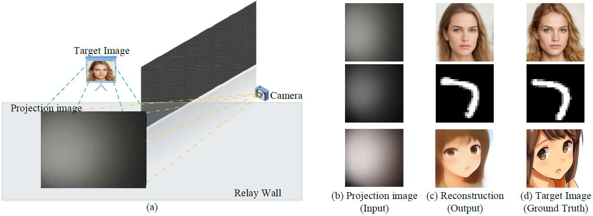
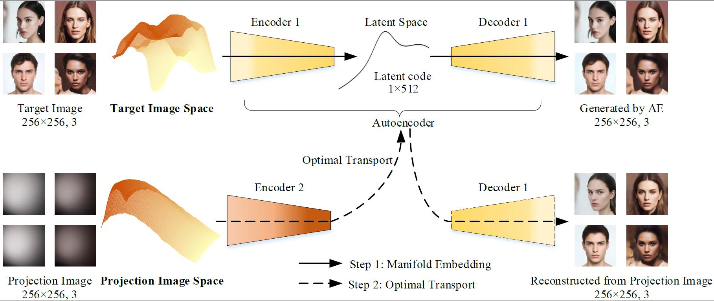
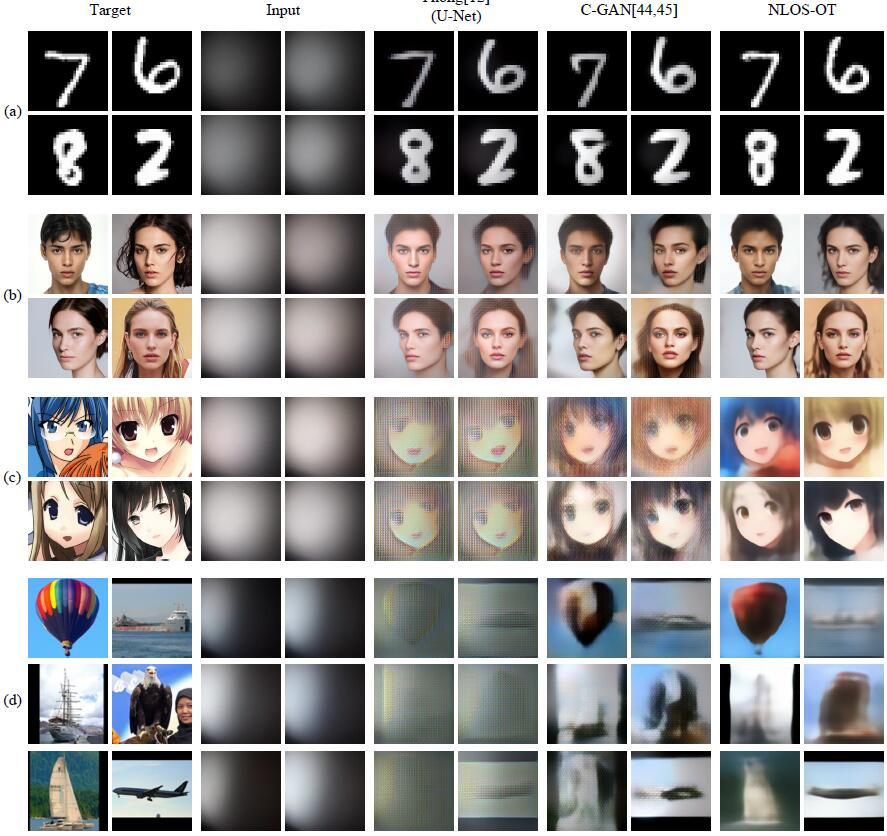
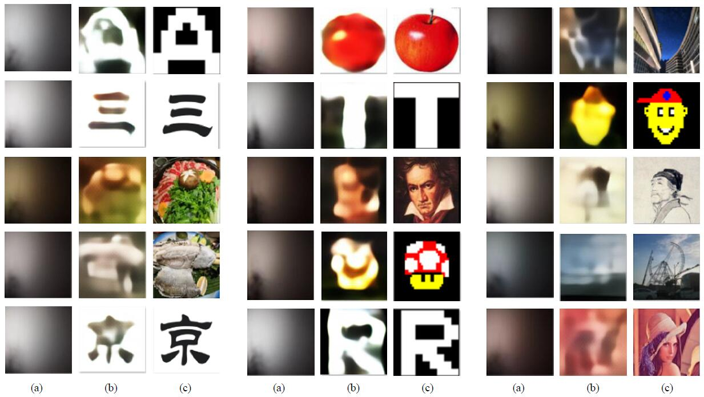
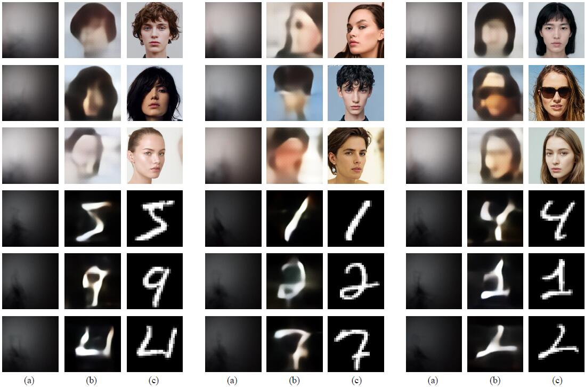

# NLOS-OT

Official implementation of NLOS-OT: Passive Non-Line-of-Sight Imaging Using Optimal Transport (IEEE TIP, accepted)

> Ruixu Geng, Yang Hu, Zhi Lu, Cong Yu, Houqiang Li, Hengyu Zhang and Yan Chen, “Passive Non-Line-of-Sight Imaging Using Optimal Transport,” IEEE Transactions on Image Processing, 2021

```
@article{nlosot,
	title = {Passive Non-Line-of-Sight Imaging Using Optimal Transport},
	journal = {IEEE Transactions on Image Processing},
	author = {Geng, Ruixu and Hu, Yang and Lu, Zhi and Yu, Cong and Li, Houqiang and Zhang, Hengyu and Chen, Yan},
	year = {2021}
}
```

## Description

In this repository, we release the ``NLOS-OT`` code in Pytorch as well as the passive NLOS imaging dataset ``NLOS-Passive``.

- Problem statement: Passive NLOS imaging
<p align="center"></p>

- NLOS-OT architecture
<p align="center"></p>

- The reconstruction results of NLOS-OT trained by specific dataset without partial occluder
<p align="center"></p>

- The generalization results of NLOS-OT trained by dataset only from [STL-10](https://cs.stanford.edu/~acoates/stl10/) with unknown partial occluder 
<p align="center"></p>
<p align="center"></p>

## Installation

1. install required packages

2. clone the repo


## Prepare Data

1. Download dataset

You can download each group in NLOS-Passive through the link below. Please note that a compressed package (.zip or .z01+.zip) represents a group of measured data.

link：https://pan.baidu.com/s/19Q48BWm1aJQhIt6BF9z-uQ 

code：j3p2

For more information about this dataset, please see [Dataset Description](/Dataset/NLOS-Passive.md). If the link fails, please feel free to contact us.

> In the following content, we will take the partially occluded dataset on STL-10 (i.e., NLOS_Passive/STL-10/stl10_dark_1_d100_occluder.zip) as an example to illustrate the training and testing process. The dataset also contains test data from other data (MNIST, supermodel faces and real scenes), which can be used to evaluate the generalization ability of NLOS-OT.

>> Similarly, you can also use other datasets to complete training and testing according to the content below.

2. Organize the files structure of the dataset

	+ Unzip the dataset

	The size of a group projection dataset on STL-10 is about 30GB, which exceeds the maximum limit of Baiduyun. Therefore, we divided each group of data into two compressed packages (.z01 and .zip). You can decompress with
	
	```bash
	cd /pathtodataset/
	zip -s 0 stl10_dark_1_d100_occluder.zip --out stl10_dark_1_d100_occluder_single.zip
	unzip stl10_dark_1_d100_occluder_single.zip
	# delete temp zip
	rm -rf ./stl10_dark_1_d100_occluder_single.zip
	# rename the folder
	mkdir ./C_dark_1_d100_occluder/
	mv ./pro ./C_dark_1_d100_occluder/train
	```

	The GT folder can be obtained by 
	```bash
	# Download gt zip. e.g., GT_stl10_allimages.zip
	# unzip and rename
	unzip GT_stl10_allimages.zip
	mkdir ./B/
	mv ./GT_stl10_allimages ./B/train
	```

	+ Organize the dataset (rename and move)

		We recommend organizing the data files according to the following structure:

		```
		.
		├── B
		│   └── train
		│   	└── 1.png
		│   	...
		├── C_dark_1_d100_wall
		│   └── train
		│   	└── 1.png
		│   	...
		├── C_dark_2_d100_wall
		│   └── train
		│   	└── 1.png
		│   	...
		└── test 
			├── C_dark_1_d100_wall_test
			│   	└── 2.png
			│   	...
			├── C_dark_1_d100_wall_val
			│   	└── 3.png
			│   	...
			├── C_dark_2_d100_wall_test
			│   	└── 2.png
			│   	...
			├── C_dark_2_d100_wall_val
			│   	└── 3.png
			│   	...
			├── gt_test
			│   	└── 2.png
			│   	...
			└── gt_val
			    	└── 3.png
			    	...
		```

		In our paper, we organize the data files using the following commands:

		+ For STL-10 (including real-world images)
		```bash
		# gt
		mkdir ./stl10_genera/chaomo_withstl10
		mkdir ./stl10_genera/MNIST_withstl10
		mkdir ./stl10_genera/real_withstl10
		mkdir ./test/gt_test
		mkdir ./test/gt_val

		mv ./B/train/*11.png ./test/gt_val
		mv ./B/train/*31.png ./test/gt_val
		mv ./B/train/*51.png ./test/gt_val
		mv ./B/train/*71.png ./test/gt_val

		mv ./B/train/*21.png ./test/gt_test
		mv ./B/train/*41.png ./test/gt_test
		mv ./B/train/*61.png ./test/gt_test
		mv ./B/train/*81.png ./test/gt_test

		mv ./B/train/testchaomo* ./stl10_genera/chaomo_withstl10
		mv ./B/train/testmnist* ./stl10_genera/MNIST_withstl10
		mv ./B/train/testreal* ./stl10_genera/real_withstl10


		# projection images
		mkdir ./stl10_genera/C_dark_1_d100_occluder_test
		mkdir ./stl10_genera/C_dark_1_d100_occluder_test/real
		mkdir ./stl10_genera/C_dark_1_d100_occluder_test/MNIST
		mkdir ./stl10_genera/C_dark_1_d100_occluder_test/chaomo
		mkdir ./test/C_dark_1_d100_occluder_test
		mkdir ./test/C_dark_1_d100_occluder_val


		mv ./C_dark_1_d100_occluder/testreal* ./stl10_genera/C_dark_1_d100_occluder_test/real
		mv ./C_dark_1_d100_occluder/testmnist* ./stl10_genera/C_dark_1_d100_occluder_test/MNIST
		mv ./C_dark_1_d100_occluder/testchaomo* ./stl10_genera/C_dark_1_d100_occluder_test/chaomo

		mv ./C_dark_1_d100_occluder/*11.png ./test/C_dark_1_d100_occluder_val
		mv ./C_dark_1_d100_occluder/*31.png ./test/C_dark_1_d100_occluder_val
		mv ./C_dark_1_d100_occluder/*51.png ./test/C_dark_1_d100_occluder_val
		mv ./C_dark_1_d100_occluder/*71.png ./test/C_dark_1_d100_occluder_val

		mv ./C_dark_1_d100_occluder/*21.png ./test/C_dark_1_d100_occluder_test
		mv ./C_dark_1_d100_occluder/*41.png ./test/C_dark_1_d100_occluder_test
		mv ./C_dark_1_d100_occluder/*61.png ./test/C_dark_1_d100_occluder_test
		mv ./C_dark_1_d100_occluder/*81.png ./test/C_dark_1_d100_occluder_test
		```


		+ For supermodel faces / MNIST / anime faces

		```bash
		# gt
		mkdir ./test/gt_test
		mkdir ./test/gt_val

		mv ./B/train/5* ./test/gt_val

		mv ./test/C_dark_1_d100_wall_val/51* ./test/gt_test
		mv ./test/C_dark_1_d100_wall_val/55* ./test/gt_test
		mv ./test/C_dark_1_d100_wall_val/59* ./test/gt_test
		# projection images
		mkdir ./test/C_dark_1_d100_wall_test
		mkdir ./test/C_dark_1_d100_wall_val

		mv ./C_dark_1_d100_wall/train/5* ./test/C_dark_1_d100_wall_val

		mv ./test/C_dark_1_d100_wall_val/51* ./test/C_dark_1_d100_wall_test
		mv ./test/C_dark_1_d100_wall_val/55* ./test/C_dark_1_d100_wall_test
		mv ./test/C_dark_1_d100_wall_val/59* ./test/C_dark_1_d100_wall_test
		```

		The above structure can be applied to the training command we provided. You can also customize your own file structure and modify the corresponding parameters (--datarootTarget, --datarootData, --datarootValTarget, --datarootValData) in the command.

## Demo / Evaluate

Before that, you should have installed the required packages and organized the data set according to the appropriate file structure.

1. Download pretrained pth

2. run the test.py


## Train

Before that, you should have installed the required packages and organized the data set according to the appropriate file structure.


## Citation
- Feel free to use the dataset / code, but please cite:

	- Ruixu Geng, Yang Hu, Zhi Lu, Cong Yu, Houqiang Li, Hengyu Zhang and Yan Chen, “Passive Non-Line-of-Sight Imaging Using Optimal Transport,” IEEE Transactions on Image Processing, 2021

	```
	@article{nlosot,
	author={Geng, Ruixu and Hu, Yang and Lu, Zhi and Yu, Cong and Li, Houqiang and Zhang, Hengyu and Chen, Yan},
	journal={IEEE Transactions on Image Processing}, 
	title={Passive Non-Line-of-Sight Imaging Using Optimal Transport}, 
	year={2021},
	volume={},
	number={},
	pages={1-1},
	doi={10.1109/TIP.2021.3128312}}
	```

- You may also be interested in our review article: 

	- Ruixu Geng, Yang Hu, and Yan Chen, “Recent Advances on Non-Line-of-Sight Imaging: Conventional Physical Models, Deep Learning, and New Scenes,” APSIPA Transactions on Signal and Information Processing, 2021


	If you think it is helpful, please consider citing

	```
	@article{RecentAdvancesNLOS,
		author    = {Geng, Ruixu and Hu, Yang and Chen, Yan},
		title     = {Recent Advances on Non-Line-of-Sight Imaging: Conventional Physical Models, Deep Learning, and New Scenes},
		journal   = {APSIPA Transactions on Signal and Information Processing},
		year      = {2021}
	}
	```
- You might also be interested in our latest work, which effectively handles multiple light transport conditions with a single network: Jiarui Zhang, Ruixu Geng, Xiaolong Du, Yan Chen, Houqiang Li, Yang Hu, "Passive Non-Line-of-Sight Imaging with Light Transport Modulation", IEEE TIP, 2024. If you think it is helpful, please consider citing

	```
	@ARTICLE{nlosltm,
	author={Zhang, Jiarui and Geng, Ruixu and Du, Xiaolong and Chen, Yan and Li, Houqiang and Hu, Yang},
	journal={IEEE Transactions on Image Processing}, 
	title={Passive Non-Line-of-Sight Imaging with Light Transport Modulation}, 
	year={2024},
	volume={},
	number={},
	pages={1-1},
	keywords={Imaging;Image reconstruction;Nonlinear optics;Image restoration;Relays;Image resolution;Degradation;Computational modeling;Cameras;Surface reconstruction;Non-line-of-sight imaging;light transport conditions},
	doi={10.1109/TIP.2024.3518097}}
	```


- We thank the following great works:

	- [DeblurGAN](https://github.com/KupynOrest/DeblurGAN), [pix2pix](https://github.com/phillipi/pix2pix): Our code is based on the framework provided by the two repos.

	- [IntroVAE](https://proceedings.neurips.cc/paper/2018/hash/093f65e080a295f8076b1c5722a46aa2-Abstract.html): The encoder and decoder in NLOS-OT are based on IntroVAE.

	- [AE-OT](https://openreview.net/forum?id=HkldyTNYwH), [AEOT-GAN](https://arxiv.org/abs/2001.03698): The idea of using OT to complete passive NLOS imaging tasks in NLOS-OT comes from the two works.
